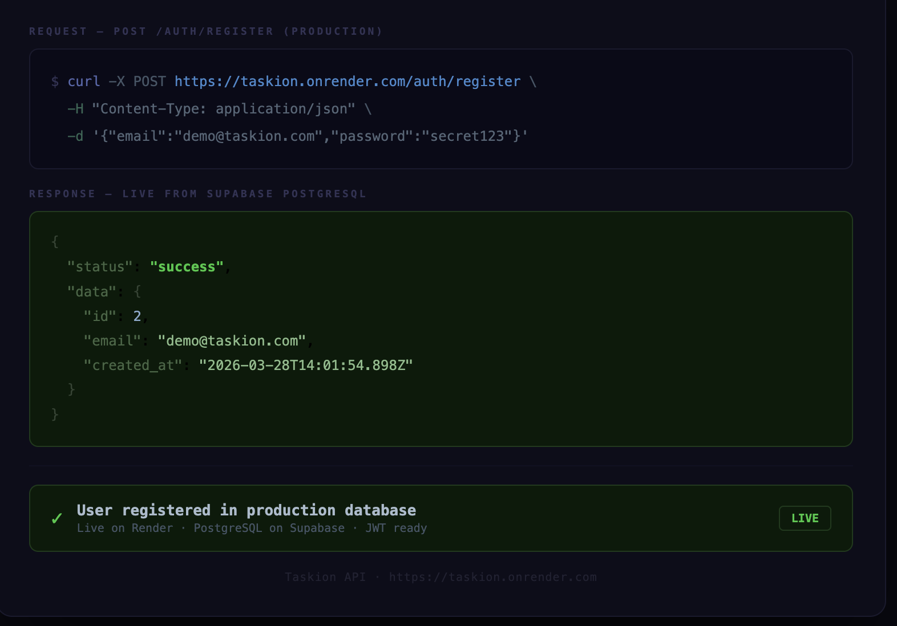

# Taskion

A secure, production-style REST API for managing personal tasks — built with Node.js, Express.js, and PostgreSQL.

---

## 🌐 Live Demo

| | |
|---|---|
| **API** | https://taskion.onrender.com |
| **Swagger Docs** | https://taskion.onrender.com/api-docs |
| **GitHub** | https://github.com/Vrishali34/taskion |

### API in Action



---

## ⚡ What Taskion Offers

### 🔐 Security First
| Feature | Details |
|---|---|
| Authentication | JWT-based register and login with bcrypt password hashing |
| Authorization | Protected routes — users can only access their own data |
| Rate Limiting | 100 req/15min globally · 10 req/15min on auth endpoints |
| Security Headers | Helmet.js — removes X-Powered-By, prevents XSS, clickjacking, MIME sniffing |
| Input Validation | Joi schemas on every endpoint — fail fast, reject early |

### 📦 Core Functionality
| Feature | Details |
|---|---|
| Task Management | Full CRUD — create, read, update, delete tasks |
| Pagination | page and limit query params with metadata in response |
| Filtering | Filter by completion status — completed=true or false |
| Sorting | Sort by id, title, or completed · asc or desc order |

### 🛠️ Production Grade
| Feature | Details |
|---|---|
| Structured Logging | Winston + Morgan — timestamped logs, HTTP audit trail, error stack traces |
| Automated Testing | 19 tests across auth and task endpoints using Jest + Supertest |
| Docker Support | docker compose up --build — API + PostgreSQL, one command |
| API Documentation | Swagger UI — interactive docs, test endpoints live from browser |
| Error Handling | Centralized middleware — consistent error format across all endpoints |

---

## 🛠️ Tech Stack

| Layer | Technology |
|---|---|
| Runtime | Node.js v24 |
| Framework | Express.js v5 |
| Database | PostgreSQL |
| Authentication | JWT + bcrypt |
| Validation | Joi |
| Security | Helmet.js + express-rate-limit |
| Logging | Winston + Morgan |
| Documentation | Swagger (OpenAPI 3.0) |
| Testing | Jest + Supertest |
| Containerization | Docker + docker-compose |
| Configuration | dotenv |

---

## 📁 Project Structure
```
taskion
│
├── config
│   └── db.js                 # PostgreSQL connection pool
│
├── controllers
│   ├── authController.js     # Register and login logic
│   └── taskController.js     # CRUD task logic
│
├── middleware
│   ├── authMiddleware.js     # JWT verification
│   ├── validateMiddleware.js # Reusable Joi validation
│   ├── morganMiddleware.js   # HTTP request logging
│   └── errorHandler.js      # Centralized error handler
│
├── routes
│   ├── authRoutes.js         # Auth endpoints + Swagger docs
│   └── taskRoutes.js         # Task endpoints + Swagger docs
│
├── validators
│   ├── authValidator.js      # Register and login schemas
│   └── taskValidator.js      # Create and update task schemas
│
├── utils
│   └── logger.js             # Winston logger configuration
│
├── docs
│   └── swagger.js            # Swagger configuration
│
├── tests
│   ├── auth.test.js          # Auth endpoint tests
│   └── task.test.js          # Task endpoint tests
│
├── screenshots
│   ├── taskion-live-register.png
│   └── taskion-jest-results.png
│
├── logs
│   ├── combined.log          # All logs (gitignored)
│   └── error.log             # Error logs only (gitignored)
│
├── app.js                    # Express app configuration
├── server.js                 # Server entry point
├── Dockerfile                # Docker image instructions
├── docker-compose.yml        # Multi-container orchestration
├── init.sql                  # Database table initialization
├── .env                      # Environment variables (not committed)
└── package.json
```

---

## ⚙️ Getting Started

### Option 1 — Run with Docker (Recommended)

Prerequisites: Docker Desktop installed
```bash
git clone https://github.com/Vrishali34/taskion.git
cd taskion
docker compose up --build
```

Server runs at `http://localhost:5000`

That's it. No manual database setup needed.

---

### Option 2 — Run Locally

Prerequisites: Node.js v20+, PostgreSQL

#### 1. Clone the repository
```bash
git clone https://github.com/Vrishali34/taskion.git
cd taskion
```

#### 2. Install dependencies
```bash
npm install
```

#### 3. Set up environment variables

Create a `.env` file in the root directory:
```
PORT=5000
DB_USER=your_db_user
DB_HOST=localhost
DB_NAME=taskdb
DB_PASSWORD=your_db_password
DB_PORT=5432
JWT_SECRET=your_jwt_secret_key
```

#### 4. Set up the database
```sql
CREATE TABLE users (
  id SERIAL PRIMARY KEY,
  email VARCHAR UNIQUE NOT NULL,
  password VARCHAR NOT NULL,
  created_at TIMESTAMP DEFAULT CURRENT_TIMESTAMP
);

CREATE TABLE tasks (
  id SERIAL PRIMARY KEY,
  title VARCHAR NOT NULL,
  completed BOOLEAN DEFAULT FALSE,
  user_id INTEGER REFERENCES users(id),
  created_at TIMESTAMP DEFAULT CURRENT_TIMESTAMP
);
```

#### 5. Start the server
```bash
npm start
```

Server runs at `http://localhost:5000`

---

## 🧪 Running Tests
```bash
npm test
```

Expected output:
```
Tests:       19 passed, 19 total
Test Suites: 2 passed, 2 total
```


---

## 📖 API Documentation

Interactive Swagger documentation available locally at:
```
http://localhost:5000/api-docs
```

Or live at:
```
https://taskion.onrender.com/api-docs
```

---

## 🔗 API Endpoints

### Authentication

| Method | Endpoint | Description | Auth Required |
|---|---|---|---|
| POST | /auth/register | Register a new user | No |
| POST | /auth/login | Login and get JWT token | No |

### Tasks

| Method | Endpoint | Description | Auth Required |
|---|---|---|---|
| GET | /tasks | Get all tasks | Yes |
| POST | /tasks | Create a new task | Yes |
| PUT | /tasks/:id | Update a task | Yes |
| DELETE | /tasks/:id | Delete a task | Yes |

### GET /tasks Query Parameters

| Parameter | Type | Description | Example |
|---|---|---|---|
| page | integer | Page number | 1 |
| limit | integer | Tasks per page | 10 |
| completed | boolean | Filter by status | true |
| sort | string | Sort field | title |
| order | string | Sort direction | desc |

---

## 🔐 Authentication Flow
```
1. Register → POST /auth/register
2. Login    → POST /auth/login → receive JWT token
3. Use token in Authorization header for all task requests
   Authorization: Bearer <your_token>
```

---

## 🛡️ Security

### Rate Limiting
- All routes — 100 requests per 15 minutes per IP
- Auth routes — 10 requests per 15 minutes per IP
- Exceeding the limit returns `429 Too Many Requests`
- Implements sliding window counter algorithm

### Helmet.js Headers
- Removes `X-Powered-By` header to hide server technology
- Sets `X-Content-Type-Options` to prevent MIME sniffing
- Sets `X-Frame-Options` to prevent clickjacking
- Sets `Content-Security-Policy` to prevent malicious content injection

---

## 📋 Logging

Winston and Morgan provide structured logging across the application.

### Log Levels
```
error  — application errors with stack traces
warn   — suspicious activity
info   — server startup and key events
http   — every HTTP request with method, URL, status, response time
```

### Log Files
```
logs/combined.log  — all log levels
logs/error.log     — errors only
```

### Example Log Output
```
2026-03-28 13:49:10 [INFO]: App configured successfully
2026-03-28 13:49:10 [HTTP]: POST /auth/register HTTP/1.1 201
2026-03-28 13:49:10 [ERROR]: Task not found — PUT /tasks/99999
```

---

## ✅ Validation Rules

### Register
- Email must be a valid email address
- Password must be at least 6 characters and max 128 characters

### Login
- Email must be a valid email address
- Password must not be empty

### Create Task
- Title is required, min 3 characters, max 255 characters

### Update Task
- Title is optional, min 3 characters, max 255 characters
- Completed is optional, must be boolean

---

## 🐳 Docker
```bash
# Start all services
docker compose up --build

# Stop all services
docker compose down

# Stop and remove volumes
docker compose down -v
```

---

## 🗺️ Roadmap

- [x] JWT Authentication
- [x] CRUD Task Operations
- [x] Pagination, Filtering, Sorting
- [x] Joi Request Validation
- [x] Swagger Documentation
- [x] Automated Testing with Jest
- [x] Rate Limiting + Security Headers
- [x] Docker Support
- [x] Winston Logging
- [x] Production Deployment

---

## 👩‍💻 Author

Vrishali — [GitHub](https://github.com/Vrishali34)
